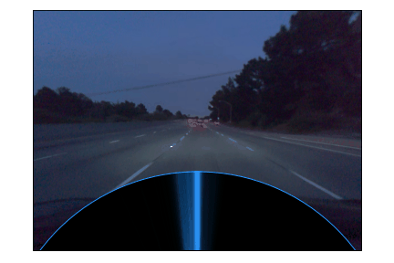

## Supplementary Code for `Marginally Calibrated Response Distributions for End-to-End Learning in Autonomous Driving' 
by Clara Hoffmann and Nadja Klein
at Humboldt-Universität zu Berlin, Emmy Noether Research Group in
Statistics and Data Science, Unter den Linden 6, 10099 Berlin

preprint available at https://arxiv.org/abs/2110.01050

This code provides the code to compute marginally calibrated predictive densities for end-to-end learners based on the implicit-copula neural linear model of Klein, Nott, Smith 2021, which we make scalable using Variational Inference.

The end result are calibrated predictive densities that can be evaluated in real-time during driving to quantify uncertainty and improve safety of end-to-end learners:

To start, download the comma2k19 data via torrent from

https://academictorrents.com/details/65a2fbc964078aff62076ff4e103f18b951c5ddb

which is ca. 100GB. Then extract all video files into the folder 'data/commaai/destination/'
and update the lists train_files_run.npy and test_files_run.npy according to how you named the video files.
The pruned data set was created by manually labelling one fifth of the entire 
data set using a web application. The resulting training indices can be found 
in the file 'data/commaai/training_files_filtered/indices/train_indices.csv'.

The code is structured as follows:

(0. 'sort_into_bags_optional' (time warning! ~7 days):
    The comma.ai 2k19 video data is reduced to frames. Each frame is sorted
    into a folder based on the associated steering angle. For obtaining appropriate
    pruning and oversampling, observations are sampled from these folders
    to create the training shards (see step 3). To run this the full comma.ai data set
    has to be downloaded as described above. This step is time and storage intensive.)

1. '01_density':
    Estimates the density for the pruned and unpruned data set.

(2. '02_write_shards_optional' (time warning! >5 days):
    Creates the training and validation shards for the pruned and unpruned data. 
    Training observations are sampled at random from the folders in step 1.
    Shards are tfrecords files, that save the images and associated steering angles 
    in binary format to save storage and speed up reading in the data while training the
    end-to-end learners. This step is very time intensive, so it is recommended to use
    the already created shards.)

3. '03_models' (time warning! >5 days):
    Trains the end-to-end learners. Extracts the basis functions for the precise and
    imprecise learners. Note that training the network might take quite long (> 2 days)
    if run on an ordinary laptop. Instead the weights from the checkpoint can just be used
    to proceede with MCMC and VA

4. '04a_MCMC':
    HMC estimation for the CPL/Ridge, CPL/Horseshoe and CIL/Ridge, CIL/Horseshoe.
   
   '04b_VA':
    VAFC estimation for the CPL/Ridge, CPL/Horseshoe and CIL/Ridge, CIL/Horseshoe.
    
5. '05_predictions':
    Creates calibration plots, explainability plots, accuracy plots for HMC vs. VAFC, qqplots,
    validation performance.
    
It is recommend to only run the code from 1., 4. and then 5. 
The files named are according to whether they produce estimations 
for the precise or imprecise data. For step 0. and 2., 3., just use the delivered data 
instead of running the code again, since these steps are extremely time intensive.
The respective outputs will be saved in the 'data' folder and folder '05_predictions'
produces the plots presented in the paper. Note that all code takes relatively long to run 
(over several days) so that it is more practical to run files on their own, then save the 
intermediate results and then run the next file, instead of running the complete code at once.

